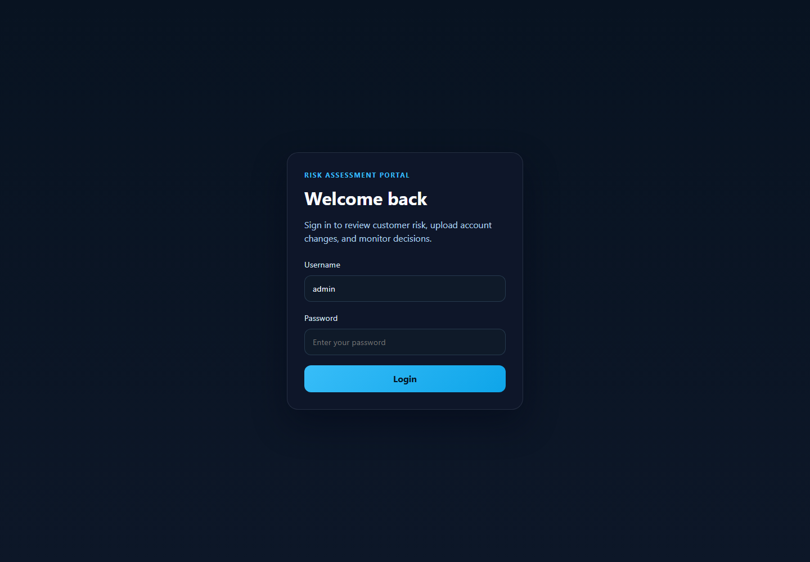

# Risk Assessment API & Financial Decision Portal

[](https://openjdk.org/)
[](https://spring.io/projects/spring-boot)
[](https://www.postgresql.org/)
[](https://www.typescriptlang.org/)
[](https://vitejs.dev/)
[](https://www.docker.com/)

---

> ## 🌟 Live Demo Spotlight
>
> ### 🔗 [https://app.adreck.ca](https://app.adreck.ca)
>
> **For Reviewers & Recruiters:**
> - **Instant Evaluation**: Click **"Access as View Only"** on the login screen to immediately explore the live dashboard, interactive customer records, risk distributions, reports, and analytics without requiring login credentials.
> - **Self-Service Access**: Request full administrative permissions using the in-portal **"Request Access"** form, which dispatches an instant notification to the system administrator.

---

## Overview

Financial institutions continuously evaluate customer risk prior to granting loans, extending credit lines, or approving financial transactions.

**Risk Assessment API** is an enterprise-grade backend service and single-page web portal that models customer risk evaluation workflows used in banking and fintech environments. The project demonstrates modern software engineering practices, clean layered architecture, robust business rules, full-stack integration, real-time analytics, automated testing, containerization, and continuous deployment.

### Key Capabilities

- **Automated Credit Risk Engine**: Evaluates credit score, annual income, existing debt, and employment status to calculate a numerical risk score and tier (`LOW`, `MEDIUM`, `HIGH`).
- **Interactive Customer Management**: Full ledger allowing users to create, search, review, and edit customer profiles directly from the web interface.
- **Visual Reports & Export**: Risk tier summaries, approval/review recommendations, and one-click printable / PDF report generation.
- **Recruiter & Visitor Analytics**: Built-in non-blocking telemetry capturing inbound channels (LinkedIn, GitHub, Portfolio, Direct), device/OS statistics, approximate visitor geography, and live audit trails.
- **Instant Alerting System**: JavaMailSender integration sending automated email notifications for access requests and recruiter evaluation sessions.
- **Frictionless View-Only Sandbox**: Non-destructive guest session mode for recruiters to evaluate the system safely.

---

## Web Dashboard

The web portal provides a sleek, responsive dark-mode interface built with modern vanilla CSS design tokens, dynamic SVG gauge visualizations, and real-time state management.



### Key Dashboard Views

1. **Overview Dashboard**: High-level KPI metric cards (Total Customers, Total Assessments, Average Risk Score), risk-level distribution, and latest evaluation activity.
2. **Customers Management**: Searchable customer registry with inline profile editing (financial details, employment status, credit metrics) and direct assessment triggers.
3. **Reports & PDF Export**: Detailed risk breakdown with visual meters and print-ready export formatting.
4. **Visitor Analytics**: Comprehensive engagement dashboard showing total page views, unique visitors, demo sessions, inbound traffic channels (LinkedIn, Portfolio, Direct), and real-time visitor event logs.

---

## Technology Stack

### Backend
- **Language & Runtime**: Java 17, OpenJDK
- **Framework**: Spring Boot 3.3
- **Persistence**: Spring Data JPA, Hibernate, PostgreSQL
- **Security & Validation**: Spring Security (JWT / Role-Based Access), Jakarta Bean Validation
- **Messaging & Notifications**: Spring Mail (`JavaMailSender`, SMTP integration)
- **API Documentation**: OpenAPI 3 / Swagger UI (`/swagger-ui/index.html`)
- **Testing**: JUnit 5, Mockito, Spring Boot Test (31 automated unit tests)
- **Build Tool**: Apache Maven (`mvnw`)

### Frontend
- **Framework & Tooling**: Vite, TypeScript
- **Styling**: Modern Vanilla CSS Design System (Custom tokens, responsive grid, glassmorphism)
- **Visuals**: Dynamic inline SVG score gauges and channel breakdown graphs
- **Telemetry**: Lightweight client-side session and navigation telemetry

### DevOps & Infrastructure
- **Containerization**: Multi-stage Dockerfile, Docker Compose
- **Continuous Deployment**: GitHub Actions CI/CD deploying directly to VPS via SSH
- **Reverse Proxy & TLS**: Nginx Proxy Manager, Let's Encrypt SSL/TLS

---

## Architecture

The backend strictly follows a decoupled, layered enterprise architecture:

```
                  ┌───────────────────────────────┐
                  │      Frontend Web Client      │
                  │  (Vite + TypeScript SPA)      │
                  └───────────────┬───────────────┘
                                  │ HTTPS / REST
                                  ▼
┌─────────────────────────────────────────────────────────────────┐
│                       Risk Assessment API                       │
│                                                                 │
│  Controllers (REST Endpoints & Validation)                      │
│     ├── AuthController                                          │
│     ├── CustomerController                                      │
│     ├── RiskAssessmentController                                │
│     ├── AccessRequestController                                 │
│     └── VisitorMetricsController                                │
│                                                                 │
│  Service Layer (Business Logic & Scoring Rules)                 │
│     ├── RiskAssessmentService (Decision & Rules Orchestration)  │
│     ├── RiskScoringService (Scoring Algorithm)                  │
│     ├── CustomerService (Entity Lifecycle)                      │
│     ├── EmailService (SMTP Alert Notifications)                 │
│     └── VisitorMetricsService (Telemetry & Analytics Parser)    │
│                                                                 │
│  Data Layer (Spring Data JPA Repositories)                      │
│     ├── CustomerRepository                                      │
│     ├── RiskAssessmentRepository                                │
│     └── VisitorEventRepository                                  │
└─────────────────────────────────┬───────────────────────────────┘
                                  │ JDBC
                                  ▼
                  ┌───────────────────────────────┐
                  │      PostgreSQL Database      │
                  │  (Transactions & Persistence) │
                  └───────────────────────────────┘
```

---

## Scoring Rules & Domain Logic

The risk engine computes a numerical score ($0 - 100$) based on weighted financial signals:

- **Credit Score (40% Weight)**: Stratified assessment from excellent credit ($\ge 750$) down to poor credit ($< 580$).
- **Debt-to-Income Ratio (30% Weight)**: Compares total debt to annual income, rewarding low leverage ($< 20\%$) and penalizing high leverage ($> 50\%$).
- **Employment Status (20% Weight)**: Evaluates stability across `EMPLOYED`, `SELF_EMPLOYED`, `UNEMPLOYED`, and `RETIRED`.
- **Income Stability (10% Weight)**: Validates base earning thresholds against current obligations.

### Classification & Recommendations

| Score Range | Risk Classification | Recommended Action |
|:---:|:---:|:---|
| **75 – 100** | `LOW` | **APPROVED** — Standard credit terms granted automatically |
| **50 – 74** | `MEDIUM` | **MANUAL REVIEW** — Secondary documentation / underwriter review required |
| **0 – 49** | `HIGH` | **REJECTED** — High probability of default |

---

## REST API Reference

Interactive OpenAPI documentation is available at `/swagger-ui/index.html`.

### Authentication & Access
| Method | Endpoint | Description | Auth Required |
|:---|:---|:---|:---:|
| `POST` | `/api/auth/login` | Authenticate with username and password | No |
| `POST` | `/api/access-requests` | Submit access request with automated email notification | No |

### Customer Management
| Method | Endpoint | Description | Auth Required |
|:---|:---|:---|:---:|
| `GET` | `/api/customers` | List all active customers | Optional / User |
| `GET` | `/api/customers/{id}` | Get customer by ID | Optional / User |
| `POST` | `/api/customers` | Create a new customer record | User |
| `PUT` | `/api/customers/{id}` | Update customer information | User |
| `DELETE` | `/api/customers/{id}` | Delete customer record | User |

### Risk Assessments
| Method | Endpoint | Description | Auth Required |
|:---|:---|:---|:---:|
| `POST` | `/api/risk-assessments` | Execute risk assessment for customer | User |
| `GET` | `/api/risk-assessments` | Retrieve assessment history | Optional / User |
| `GET` | `/api/risk-assessments/customer/{id}` | Get assessments for customer | Optional / User |

### Visitor & Recruiter Analytics
| Method | Endpoint | Description | Auth Required |
|:---|:---|:---|:---:|
| `POST` | `/api/metrics/track` | Public non-blocking telemetry ingestion | No |
| `GET` | `/api/metrics/summary` | Retrieve aggregated visitor stats & recent events | User |

---

## Local Development & Setup

### Prerequisites
- **Java 17+**
- **Maven 3.8+** (or use included `./mvnw`)
- **Node.js 18+** & **npm**
- **Docker & Docker Compose** (optional, recommended)

### 1. Running Backend Locally
```bash
# Clone the repository
git clone https://github.com/AdrianoReckziegel/risk-api.git
cd risk-api

# Start PostgreSQL database (via Docker or local instance)
docker run --name risk-postgres -e POSTGRES_DB=riskdb -e POSTGRES_USER=riskuser -e POSTGRES_PASSWORD=riskpass -p 5432:5432 -d postgres:15-alpine

# Run the Spring Boot application
./mvnw spring-boot:run
```
The API starts at `http://localhost:8080`.

### 2. Running Frontend Locally
```bash
cd frontend
npm install
npm run dev
```
The development web dashboard is available at `http://localhost:5173`.

### 3. Automated Test Suite
Run all unit and integration tests:
```bash
./mvnw test
```

---

## Docker & Container Deployment

### Full Stack via Docker Compose
1. Copy the environment configuration template:
   ```bash
   cp .env.example .env
   ```
2. Configure credentials in `.env` (`POSTGRES_PASSWORD`, `JWT_SECRET`, `CORS_ALLOWED_ORIGINS`).
3. Build and launch all services:
   ```bash
   docker compose up --build -d
   ```

### Reverse Proxy & Nginx Proxy Manager Setup
To host the frontend with Nginx Proxy Manager:
- **Domain Name**: `app.adreck.ca`
- **Forward Scheme**: `http`
- **Forward Hostname**: `risk-frontend`
- **Forward Port**: `80`
- **SSL**: Enable Let's Encrypt Certificate with Force SSL.

Ensure `CORS_ALLOWED_ORIGINS` in your environment includes your domain:
```env
CORS_ALLOWED_ORIGINS=http://localhost:3000,http://127.0.0.1:3000,http://app.adreck.ca,https://app.adreck.ca
```

---

## Automated VPS CI/CD Deployment

Every push to the `main` branch automatically triggers GitHub Actions:
1. Executes the Maven automated test suite.
2. Builds and validates Docker container images.
3. Securely connects to the production VPS via SSH.
4. Pulls latest updates and triggers zero-downtime container rolling recreation:
   ```bash
   docker compose up -d --build --remove-orphans
   ```

---

## Author

**Adriano Reckziegel**  
Software Developer specializing in Enterprise Java, Spring Boot, and Financial Systems.

- **Live Application**: [https://app.adreck.ca](https://app.adreck.ca)
- **GitHub**: [https://github.com/AdrianoReckziegel](https://github.com/AdrianoReckziegel)
